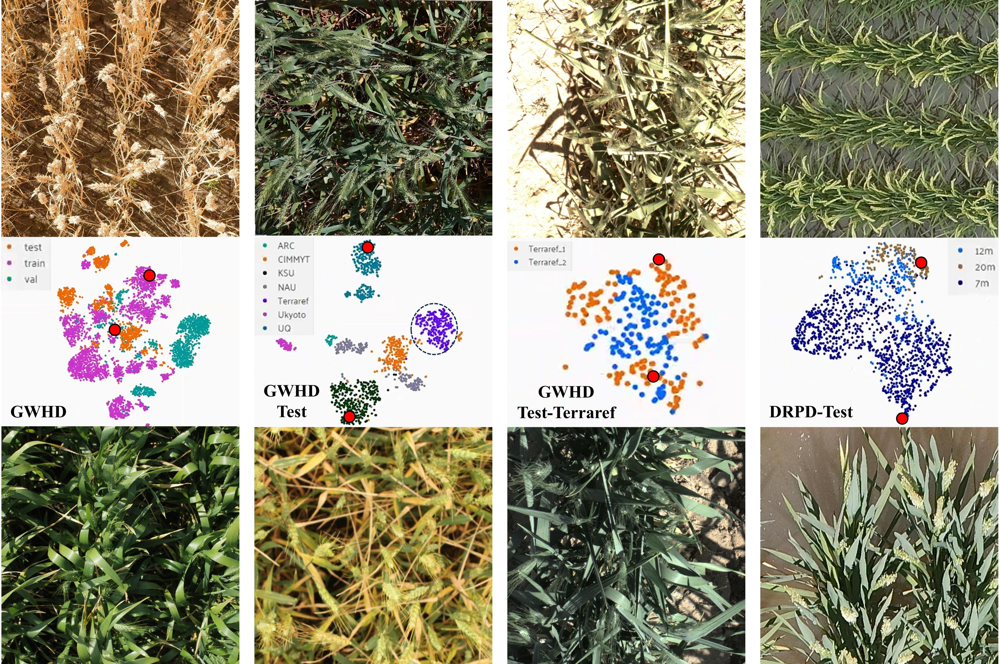

# MSO-Det

Official implementation of **MSO-Det: A Multi-Level Synergistic Optimization
Framework for Robust Spike Object Detection in Field Scenes**.

MSO-Det is a lightweight Transformer-based detector for robust wheat-head and
rice-panicle detection under density variation, occlusion, background shift,
growth-stage differences, and changes in acquisition platform. It extends
D-FINE-S with three connected components at the representation, interaction,
and supervision levels: ASWB, MSIA, and UGDR.

## Field-scene challenges

<p align="center">
  
</p>

The figure shows representative GWHD and DRPD images together with t-SNE
projections of CLIP-ViT-Base/32 embeddings. The separated distributions reflect
substantial variation in target density, growth stage, background, viewpoint,
acquisition domain, and flight height. MSO-Det is designed to address three
related difficulties exposed by these settings:

- **Density-dependent representation:** sparse and crowded scenes require
  different feature-propagation behavior.
- **Cross-scale and cross-domain correspondence:** spikes with similar semantics
  may appear at different scales and under markedly different backgrounds.
- **Localization ambiguity:** overlap and occlusion produce uncertain object
  boundaries and noisy localization supervision.

## Method overview

<p align="center">
  
</p>

MSO-Det uses HGNetv2 to extract feature maps at strides 8, 16, and 32, followed
by a D-FINE hybrid encoder and Transformer decoder. The proposed modules form a
connected representation-interaction-supervision pipeline:

1. **Adaptive Scene Wave Block (ASWB)** operates on the semantic P5 feature. It
   predicts scene-conditioned wave parameters, performs global frequency-domain
   propagation, and applies channel-wise self-modulation. Placing ASWB at P5
   provides a global receptive field at low spatial cost.
2. **Multi-Scale Interactive Aggregation (MSIA)** collects P3, P4, and the
   ASWB-conditioned P5 feature into a shared semantic space. Hypergraph message
   passing models many-to-many relationships across scales before the enhanced
   features are scattered back to the decoder inputs.
3. **Uncertainty-Guided Distribution Refinement (UGDR)** derives localization
   uncertainty from the decoder's side-distance distributions and adjusts the
   localization objective through curriculum-controlled weighting. UGDR is used
   only during training and introduces no inference-time parameters or FLOPs.

The forward path carries the ASWB-conditioned representation through MSIA to
the decoder. During training, UGDR supplies sample-dependent localization
gradients through the decoder and MSIA to the upstream encoder. This bidirectional
connection is the basis of the multi-level synergistic design.

## Main results

The following results use a 640 x 640 input and the evaluation protocol reported
in the manuscript.

| Method | AP | AP@0.50 | AP@0.75 | AP_s | AP_m | AP_l | Params (M) | FLOPs (G) |
| --- | ---: | ---: | ---: | ---: | ---: | ---: | ---: | ---: |
| D-FINE-S | 22.2 | 56.6 | 13.1 | 4.8 | 24.6 | 39.1 | 10.2 | 24.8 |
| **MSO-Det** | **32.2** | **66.0** | **27.8** | **7.8** | **36.2** | **49.4** | 10.7 | 29.3 |

For direct wheat-to-rice transfer, both models are trained on GWHD and evaluated
on DRPD without fine-tuning. MSO-Det obtains 24.9 AP, 47.1 AP@0.50, and 21.8
AP@0.75, compared with 22.7, 43.3, and 21.5 for D-FINE-S.

## Repository layout

```text
MSO-Det/
|-- assets/                         README figures
|-- configs/
|   |-- yaml/mso-det.yml            Training and evaluation entry config
|   |-- cfg/mso-det.yaml            MSO-Det architecture definition
|   `-- dataset/custom_detection.yml
|-- engine/
|   |-- paper_first/                ASWB, MSIA, and UGDR implementations
|   |-- backbone/                   HGNetv2 and alternative backbones
|   |-- deim/                       D-FINE/DEIM detector components
|   `-- solver/                     Training and evaluation loops
|-- analysis/synergy/               Factorial and mechanism analyses
|-- logs/                           Eight controlled module-combination runs
|-- tools/                          Validation, deployment, and visualization tools
|-- weights/                        Released checkpoints
|-- requirements.txt
`-- train.py
```

## Installation

The reference environment uses Python 3.11 and PyTorch 2.2.1. Install the
PyTorch build matching your CUDA environment first, then install the remaining
dependencies.

```bash
conda create -n mso-det python=3.11 -y
conda activate mso-det

# Install PyTorch 2.2.1 for your CUDA version first.
pip install -r requirements.txt
```

## Dataset preparation

The default configuration expects COCO-format GWHD annotations with the
following layout:

```text
data/gwhd_2021/
|-- train/images/
|-- test/images/
`-- annotations/
    |-- train.json
    `-- test.json
```

For another COCO-format detection dataset, update the image and annotation
paths, `num_classes`, and category-remapping option in
`configs/dataset/custom_detection.yml`.

## Released checkpoints

Download `mso-det.pth` and `dfine.pth` from
[Google Drive](https://drive.google.com/drive/folders/1FDmwMX__b8I_dq2xR97zQ12rfibWprS8?usp=sharing)
and place them under `weights/`.

```text
weights/
|-- mso-det.pth
`-- dfine.pth
```

## Training

Single GPU:

```bash
python train.py -c configs/yaml/mso-det.yml
```

Multiple GPUs:

```bash
torchrun --master_port=9940 --nproc_per_node=${NUM_GPUS} \
  train.py -c configs/yaml/mso-det.yml
```

Automatic mixed precision can be enabled with `--use-amp`. To resume an
interrupted run, pass its checkpoint with `-r`:

```bash
python train.py -c configs/yaml/mso-det.yml \
  -r /path/to/checkpoint.pth
```

The default output directory is `outputs/mso-det/`. It can be overridden with
`--output-dir`.

## Evaluation

Single GPU:

```bash
python train.py -c configs/yaml/mso-det.yml \
  -r weights/mso-det.pth --test-only
```

Multiple GPUs:

```bash
torchrun --master_port=9928 --nproc_per_node=${NUM_GPUS} \
  train.py -c configs/yaml/mso-det.yml \
  -r weights/mso-det.pth --test-only
```

The evaluator reports COCO bounding-box metrics, including AP, AP@0.50,
AP@0.75, and scale-specific AP.

## Module validation

Run the lightweight implementation checks for ASWB, MSIA, and UGDR:

```bash
python tools/validate_paper_modules.py
```

These checks verify the configured module interfaces, output shapes, finite
forward/backward values, and the training-only behavior of UGDR.

## Synergy diagnostics

The `analysis/synergy/` directory provides the controlled `2^3` factorial
analysis used to examine module interactions. It includes AP and AP@0.75 traces
for all eight ASWB/MSIA/UGDR combinations and reports conditional gains,
order-averaged contributions, factorial interactions, retention efficiency, and
training-stage diagnostics.

Recompute the analysis from the included traces:

```bash
python3 analysis/synergy/analyze_synergy.py
```

Or regenerate the trace file from the eight raw run directories:

```bash
python3 analysis/synergy/analyze_synergy.py \
  --logs-root logs \
  --export-traces analysis/synergy/data/factorial_epoch_metrics.csv
```

See [analysis/synergy/README.md](analysis/synergy/README.md) for the output
schema, calculation definitions, mechanism diagnostics, and figure-generation
commands.

## Citation

```bibtex
@misc{wang2026msodet,
  title  = {MSO-Det: A Multi-Level Synergistic Optimization Framework for Robust Spike Object Detection in Field Scenes},
  author = {Wang, Yiqun and Zhang, Shuo and Liu, Xiaolong and Ji, Ze and Jia, Weikuan},
  year   = {2026}
}
```

The citation entry will be updated with the final publication metadata.

## Acknowledgements

This implementation is built on the D-FINE and DEIM detection framework. MSIA
also draws on the HGC-SCS hypergraph fusion design introduced by Hyper-YOLO. We
thank the authors of these projects and the maintainers of the GWHD and DRPD
datasets.

## License

This repository is released under the [Apache License 2.0](LICENSE).
